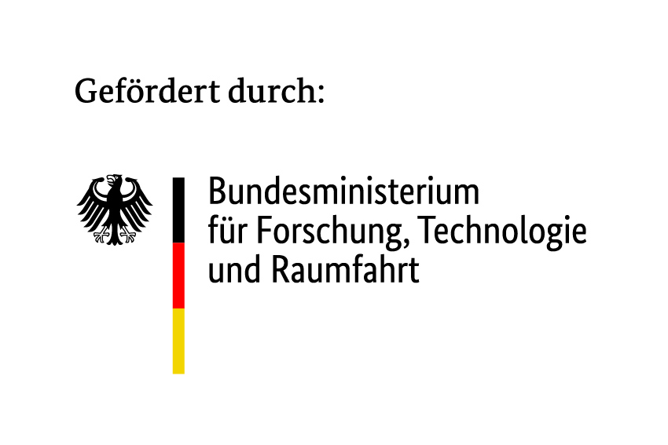
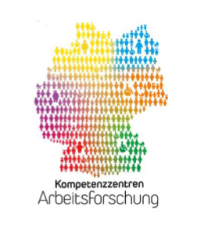

# feature-viz

Live object detection (Ultralytics YOLO26) shown next to the feature maps of
selected network layers, rendered as greyscale tile grids. A demonstrator for
talks and handover, not a library.

```bash
pdm install
pdm run feature-viz          # auto profile, stream on http://localhost:8080/
```

`DECISIONS.md` records why the code is shaped the way it is, including the
alternatives that were rejected. Read it before changing anything structural.

## Funding

The [K-M-I research and development project](https://kmi-netzwerk.org/kmi-projekt/) is funded as part of the “Future of Work: Regional Competence Centers for Labor Research – Artificial Intelligence” funding initiative within the “Innovations for Tomorrow's Production, Services, and Work” program of the German Federal Ministry of Research, Technology and Space (BMFTR) and is supervised by the Project Management Agency Karlsruhe (PTKA).

<p align="left">
  
  
</p>

The running demonstrator carries the same notice, both on the served web page
and in a strip along the bottom of the video canvas (`DECISIONS.md` §17).

## License

**GNU Affero General Public License v3.0 or later** (AGPL-3.0-or-later). The
full text is in [LICENSE](LICENSE).

The demonstrator is built around [Ultralytics](https://github.com/ultralytics/ultralytics)
YOLO, which is AGPL-3.0-or-later, so the combined work is AGPL as well. It also
serves its output over HTTP, which engages AGPL §13: anyone interacting with a
running instance over a network must be offered the corresponding source. The
served page carries that notice and a link. If you deploy a modified version,
point that link at your version. See `DECISIONS.md` §16.

Model weights are downloaded at runtime from Ultralytics and are not part of
this repository. They carry Ultralytics' own terms.

The two logos in `src/feature_viz/funding/` are not covered by the AGPL. They
belong to their respective owners and are included, unmodified, solely to
meet the funding acknowledgement requirement.

Other dependencies are permissively licensed: PyTorch (BSD/Apache-2.0), OpenCV
(Apache-2.0), NumPy (BSD-3-Clause).
